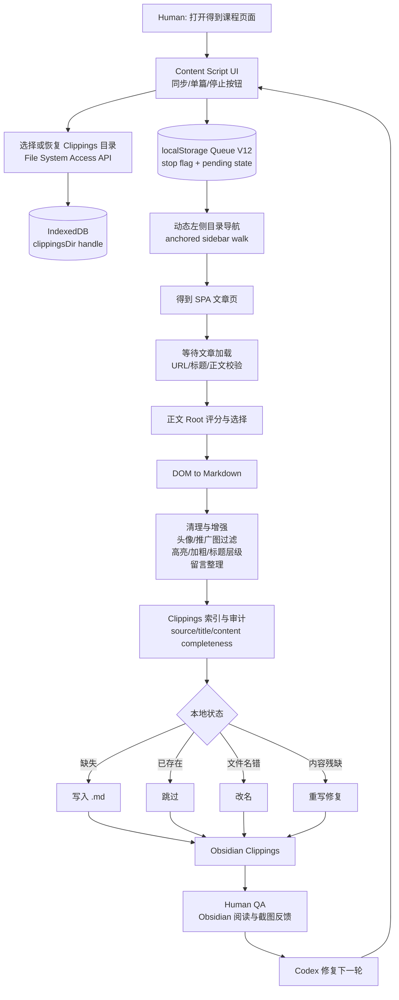
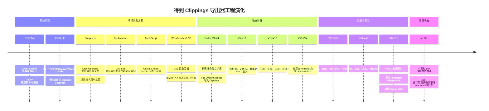

# 得到课程文章到 Obsidian Clippings：Engineering Case Study

> 这不是最终用户 README，而是一份工程档案。读者是未来的 Melodie，以及以后接手维护的 AI，例如 Claude Code。
>
> 本文记录的是一次真实的 Human + AI 软件工程协作：需求从“把得到文章批量保存到 Obsidian”开始，经历了多轮失败、重构、产品判断、人工验收，最终形成一个可在 Chrome 内直接同步得到课程文章到本地 Clippings 文件夹的扩展。

## Project Overview

这个项目是一个独立 Chrome 扩展：**得到 Clippings 导出器**。

它运行在 `www.dedao.cn` 的课程文章页面上，在页面右上角注入控制按钮，把得到课程文章直接保存为 Obsidian 可读的 Markdown 文件，并写入：

```text
/Users/melodie2026/Documents/MelodieOS/Clippings
```

它的核心目标不是“爬一点文字”，而是：

- 批量保存已购得到课程里的文章。
- 尽量忠实保留网页可见内容，包括标题、正文层级、图片、重点、橙色强调、正文小标题、课后留言。
- 生成适合 Obsidian 阅读、检索和归档的 `.md` 文件。
- 支持课程中断后继续、检查已保存文件、补漏、改名、修复明显残缺文件。
- 让非技术用户只在网页上点按钮，不需要终端、npm、Chrome profile、脚本调试。

当前代码位置：

```text
02-workflow-automation/course-clippings-exporter
├── README.md
└── extension
    ├── manifest.json
    ├── content.js
    └── icon.png
```

当前主实现集中在：

```text
extension/content.js
```

截至本文记录时，`content.js` 内部版本是 `1.56`，manifest 版本是 `1.55`。这是一个小的技术债：后续维护时应统一版本号，并更新 README，使 README 不再描述旧按钮。

## Original Problem

最初的问题很简单，但规模很大：

- Melodie 在得到上有几十门已购课程。
- 每门课大约 10 到 400 篇文章。
- 总量超过 1000 篇。
- 目标是把这些文章保存到 Obsidian，作为长期知识库。

原来的人工流程是：

1. 打开得到文章页面。
2. 按 `Cmd + Shift + O` 触发 Obsidian Web Clipper。
3. 确认保存。
4. 处理 Chrome 的 `beforeunload` 弹窗。
5. 打开下一篇。

每篇约 5 秒。1000 篇文章意味着要机械操作一整天，而且非常容易漏、重复、命名混乱。

已有基础设施包括：

- Chrome 已登录得到。
- Chrome 已安装 Obsidian Web Clipper。
- Obsidian Web Clipper 已能把单篇文章保存到 `Clippings`。
- 用户有现成课程分类目录，后续会把 Clippings 里的文章归档到 `01_科技思维`、`02_管理领导力` 等课程分类里。

但是现有工具不能满足批量需求：

- Obsidian Web Clipper 擅长单篇保存，但不能一键保存整门课。
- 得到网页没有提供批量导出。
- 课程目录是前端渲染的动态列表，不是简单的 `<a href>` 列表。
- 很多课程有上百篇，甚至三四百篇，手动操作不可持续。

## Product Requirements Evolution

### 1. 从“批量打开 + Obsidian 插件保存”到“直接写 Markdown”

最初设想是自动打开文章，然后模拟 Obsidian Web Clipper 的快捷键。

这个想法的问题是：

- 自动控制 Chrome 和扩展快捷键非常不稳定。
- Obsidian Clipper 保存流程有弹窗和前台状态。
- Chrome 页面有 beforeunload 提示。
- 大量文章时任何一个弹窗都会中断。

后来方向转成：**不再调用 Obsidian Clipper，而是在得到页面里直接解析 DOM，生成类似 Obsidian Clippings 的 Markdown，并写入本地文件夹。**

这是第一个关键产品转向。

### 2. 从“提取 URL”到“提取内容”

WorkBuddy 早期方向是先提取整门课所有 URL，再批量打开。

实际遇到的问题是得到的课程侧栏不是稳定 URL 列表：

- 很多条目是 Vue/React 渲染的 `<li>` 组件。
- 条目没有直接 `href`。
- 点击行为由 JavaScript 绑定。
- 侧栏是懒加载或虚拟滚动，页面一开始只渲染一部分。

因此项目逐步从“先拿完整 URL 表”转为“在当前页面和当前可见侧栏上动态向下走”。

### 3. 从“能保存文字”到“忠实保存阅读结构”

早期 Codex 版本能保存文字，但用户指出：

- 文件名错误，例如保存成 `我的学习 - 得到APP.md`，或者保存成图片 URL。
- 正文格式不对。
- 小标题没有变成 Markdown heading，Obsidian 右侧目录没有层级。
- 原文橙色重点和加粗没有忠实保留。
- 有时整段被错误高亮，导致“重点失真”。
- 作者头像、课程宣传图等不应出现在笔记里。
- 但如果头像表示“这里是香帅回复”，不能一刀切删除语义，需要保留 `香帅：` 这样的说话人信息。
- 用户留言有价值，但需要整理成可读格式，不要保留无意义控件文本。

这使需求从“爬取正文”升级为“面向 Obsidian 阅读体验的结构化保存”。

### 4. 从“批量导出”到“同步、检查、补漏、修复”

在小课程里，批量保存可以跑通。但在 60+、395+ 的课程里，问题变成：

- 保存到某一节后卡住。
- 从断点重新点批量导出，又跳回第一篇。
- 前面已保存的文章会被反复打开、反复跳过。
- 课程目录虚拟滚动只渲染当前附近几十条，无法一次拿到 400 条。
- 有些文件已存在但文件名错。
- 有些文件已存在但内容残缺。
- 有些文章页面已经打开过，但没有成功写入 Markdown。

因此按钮语义从“导出”变成“同步”：

> 同步 = 当前页开始，检查本地文件夹，已正确存在就跳过，缺失就补，source 对但文件名错就改名，明显残缺就重写。

用户进一步提出：导出和检查本来就应该内化到一个按钮里。第一遍点是导出，第二遍点就是检查和补漏，不应该让用户在多个按钮之间理解状态机。

这成为后期产品方向：**一个主按钮承担导出、检查、同步、补漏。**

### 5. 增加停止按钮

当批量任务循环失败时，页面刷新后仍继续跑，用户无法停止，只能关页面。

这暴露出自动化产品必须有“刹车”：

- 清掉 localStorage 队列。
- 清掉 pending 标记。
- 清掉旧版本状态。
- 设置 stop flag。
- 刷新后不再自动续跑。

因此加入了 `停止批量导出` 按钮。

## Technical Exploration

### 方案 1：Node.js + Puppeteer 控制 Chrome

目标是用 Puppeteer 打开得到文章、调用 Obsidian Clipper、自动下一篇。

失败原因：

- Puppeteer 需要启动一个带 Obsidian 扩展的 Chrome 实例。
- 需要管理 Chrome profile。
- Chrome profile 有锁文件冲突。
- 强制 kill 后 profile 曾出现损坏或无法启动。
- 对非技术用户来说调试成本过高。

结论：技术上可行，但不符合“用户无需配置环境”的产品约束。

### 方案 2：Bookmarklet 或 Console JS

目标是在当前 Chrome 页面直接执行脚本。

失败原因：

- Chrome DevTools Console 禁止直接粘贴，需要输入 `allow pasting`。
- 地址栏运行 `javascript:` 前缀有安全限制和使用摩擦。
- 每门课都要手动处理，仍然不是稳定产品。

结论：适合临时调试，不适合长期使用。

### 方案 3：AppleScript 控制现有 Chrome

目标是让 AppleScript 控制已登录的 Chrome。

失败原因：

- 需要 Chrome 开启 `Allow JavaScript from Apple Events`。
- 用户找不到对应菜单。
- 终端 `defaults write` 没有生效。
- 仍然依赖系统级自动化权限和浏览器行为。

结论：环境依赖太多，不适合非技术用户。

### 方案 4：WorkBuddy 的 URL 提取扩展

WorkBuddy 尝试了多个版本：

- V1-V4：用 CSS selector 找 `<a href>`，结果 0 篇，因为侧栏不是链接列表。
- V5：尝试得到 API，例如 `/pc/player/api/column/detail`，返回空或 404。
- V6：采集 `<li>` 的 data 属性，只找到当前页。
- V7：滚动侧栏、展开章节，仍只找到 1 篇。
- V8：拦截 XHR/fetch，遇到超时或限流。
- V9：多重 DOM fallback，仍未稳定。

核心失败点是：得到课程目录是动态渲染、懒加载、点击驱动的 SPA 组件，不是静态 URL 表。

结论：只做 URL 提取不够，必须把“当前页内容解析 + 动态导航 + 本地文件同步”合成一个系统。

### 最终方案：Chrome Content Script + File System Access API

最终选择当前架构的原因：

- 直接运行在用户已登录的得到页面中，不需要重新登录。
- 不需要 Puppeteer、Node、终端或额外安装。
- 可以读取当前页面 DOM，保留样式语义和可见内容。
- 可以通过 File System Access API 让用户一次授权 Clippings 文件夹，之后直接写文件。
- 可以通过 localStorage 保存队列状态，实现跨页面续跑。
- 可以通过 IndexedDB 保存目录 handle，减少重复选择文件夹。
- 可以把导出、检查、补漏、改名、修复都放进一个页面按钮。

## Architecture

### Runtime Model

扩展是 Manifest V3 content script：

```json
{
  "matches": ["*://www.dedao.cn/*"],
  "js": ["content.js"],
  "run_at": "document_idle"
}
```

它没有 background service worker，也没有额外权限。所有逻辑都在得到页面上下文中运行。

### UI Layer

`content.js` 注入右上角控制面板：

- `同步MD到Clippings v${VERSION}`：主按钮，承担导出、检查、补漏、修复。
- `只导出当前文章`：调试和单篇测试。
- `停止批量导出`：清队列、停续跑。

旧 README 里仍写着 `提取全部文章URL`、`导出MD到Clippings` 等早期按钮，这是文档债。

### Storage Layer

本地保存分两层：

1. File System Access API
   - 用户第一次选择 `/Users/melodie2026/Documents/MelodieOS/Clippings`。
   - 之后扩展直接读写该目录里的 `.md` 文件。

2. IndexedDB
   - 数据库：`dedaoMdExportDb`
   - store：`handles`
   - key：`clippingsDir`
   - 用于持久化目录 handle。

队列和运行状态使用 localStorage/sessionStorage：

```js
QUEUE_KEY = 'dedaoMdExportQueueV12'
PENDING_COURSE_EXPORT_KEY = 'dedaoMdPendingCourseExportV12'
CANONICAL_RESTART_COUNT_KEY = 'dedaoMdCanonicalRestartCountV12'
STOP_KEY = 'dedaoMdExportStoppedV12'
```

代码还会清理 V1-V11 的遗留状态，避免旧版本自动续跑影响新版本。

### Article Extraction Pipeline

单篇文章保存大致流程：

1. 等待文章页面加载完成。
2. 判断页面是否是可用文章页。
3. 找到文章正文 root。
4. 通过 DOM 转 Markdown。
5. 清理页面 chrome：
   - 顶部导航
   - 搜索框
   - 播放器控制
   - 无关按钮
   - 作者头像
   - 课程宣传图
6. 保留内容元素：
   - 标题
   - 正文
   - 图片
   - 橙色强调
   - 加粗
   - 小标题
   - 用户留言
7. 增强 Markdown 层级，使 Obsidian 右侧目录可用。
8. 生成 YAML/frontmatter 风格属性。
9. 根据标题生成安全文件名。
10. 写入、跳过、改名或修复文件。

### Batch/Sync Pipeline

整门课同步不是一次性拿完整 URL 表，而是动态走侧栏：

1. 以当前页面为起点。
2. 保存或检查当前文章。
3. 扫描 Clippings 目录，建立本地索引。
4. 判断当前文章对应文件：
   - source 正确且标题正确：已存在，跳过。
   - source 正确但文件名错误：改名。
   - source 正确但内容明显残缺：重写。
   - 不存在：保存。
5. 在左侧课程目录中寻找下一篇。
6. 点击下一篇。
7. 等待 URL 或标题变化。
8. 重复。

这个流程为了适配得到侧栏虚拟滚动，后来演化成“动态 anchored walk”：

- 不再假设一开始能看到完整目录。
- 不再静态保存一个全课程 URL 数组。
- 只相信当前可见窗口和当前文章锚点。
- 每保存完一篇，再在当前附近寻找下一篇。

### Mermaid Architecture Diagram



## Version History

这里按工程阶段记录，不逐一列出约 51 个小版本。实际版本号在 UI 上从早期多次迭代到 `v1.56`，中间还清理了 V1-V11 的 legacy state。以下是关键架构节点。

### WorkBuddy V1-V9：URL 提取阶段

目标：

- 从得到课程侧栏提取整门课文章 URL。
- 后续再交给自动化脚本或 Obsidian Clipper。

遇到的问题：

- 侧栏不是 `<a href>`。
- API 不稳定或不可用。
- data 属性只能拿到当前文章。
- 懒加载和虚拟滚动导致无法一次看到全列表。
- XHR/fetch 拦截复杂且不稳定。

为什么失败：

- 方案把问题简化成“URL 列表提取”，但真实问题是“动态 SPA 课程目录 + 可见内容保存 + 本地文件同步”。

### Codex V1-V4：独立扩展与绿色 UI

目标：

- 不再修补 WorkBuddy。
- 新建独立扩展，互不干扰，便于对比。
- 换绿色按钮和 icon，避免与 WorkBuddy 紫色 UI 混淆。

实现变化：

- 建立 `dedao-clippings-exporter/extension`。
- 注入右上角按钮。
- 通过 File System Access API 选择 Clippings 文件夹。
- 初步支持当前文章导出。

主要问题：

- 文件名可能错误。
- 有时保存成页面标题 `我的学习 - 得到APP`。
- 有时保存成图片 URL。
- 正文结构和 Obsidian Clipper 差异大。

### V5-V10：从“能写文件”到“能生成可读 Markdown”

目标：

- 文件名必须来自真实文章标题。
- 内容不能只是页面 textContent。
- 图片、正文、标题要尽量保留。

实现变化：

- 增加文章 root 识别。
- 增加 title 解析和 filename 清理。
- 增加图片 Markdown 输出。
- 增加 source/frontmatter。

主要问题：

- 标题仍可能来自错误节点。
- 第一段文字或图片 URL 可能误判成标题。
- 有些课程文章以图片开头，标题提取更容易错。

### V11-V18：格式忠实度阶段

目标：

- 对齐 Obsidian Web Clipper 的阅读体验。
- 忠实保留原文橙色字体和加粗。
- 避免过度高亮。
- 移除作者大头像和无关宣传图。
- 保留“谁在说话”的语义。

典型测试样本：

- `033｜毒丸计划：如何抵御门口的野蛮人？`
- `加餐｜深度解析阿里金融帝国`
- `010｜本周问答：如何投资A股市场更明智？`
- `“投行”问答丨注册制会给中国股市带来什么影响？`

实现变化：

- 修正 bold/highlight 判定，不再把整段误判为重点。
- 删除头像图片，但将问答或回复语境转换为类似 `香帅：` 的文本标记。
- 整理用户留言，减少按钮、关注、分享等噪音。
- 评论区变成清晰的 `用户留言` 区块。

主要问题：

- 一度评论区丢失。
- 一度高亮过多。
- 一度头像删掉后语义也丢了。

这些问题都来自同一个根因：DOM 样式和页面结构不是语义化 HTML，需要人为定义“哪些视觉元素在笔记中有意义”。

### V19-V24：Obsidian 层级与目录阶段

目标：

- 正文小标题必须成为 Markdown heading。
- Obsidian 右侧 outline 要能显示正文层级，而不是只有 `用户留言`。

典型反馈：

- `第一天`、`第二天`、`第三天` 这种原文加粗层级应进入目录。
- `模块导读｜金融世界观` 中的小标题应成为层级。
- 薛兆丰经济学课里的 `1.美好愿望不一定带来美好结果` 等编号小标题也应进入目录。

实现变化：

- 增加 `enhanceMarkdownHierarchy`。
- 增加中文小标题、编号标题、短句标题的启发式判断。
- 增加避免把普通正文误升为标题的保护。

主要问题：

- 早期是按关键词或少量模式识别，导致“修一个抓一个”。
- 用户明确指出不能靠限定词汇，因为课程标题和小标题可以是任意内容。

结论：

- 标题识别必须基于结构、位置、长度、样式、上下文，而不是关键词表。

### V25-V33：批量导航阶段

目标：

- 从单篇导出进入整门课批量保存。
- 支持 9-11 篇的小课完整跑完。

典型课程：

- `有效提升你的职场价值`
- `怎样快速搞懂一家公司`

实现变化：

- 增加队列。
- 增加页面跳转后的自动续跑。
- 禁用 beforeunload。
- 增加下一篇查找。
- 增加停止按钮。

主要问题：

- beforeunload 弹窗会阻塞。
- 有时页面跳到错误文章。
- 有时只保存第一篇。
- 有时保存完一篇需要用户点 OK，流程不够自动。
- 有时从当前断点开始却跳回发刊词。

### V34-V43：检查、补漏、改名、修复阶段

目标：

- 批量跑完后可以自动检查本地库。
- 如果跳过或失败，可以补回来。
- 如果名字不对，可以改名。
- 如果 source 对但内容残缺，可以重写。

实现变化：

- 增加 `scanClippingsIndex`。
- 增加 `extractSourceFromMarkdown`。
- 增加 `extractTitleFromMarkdown`。
- 增加 `auditMarkdownInClippings`。
- 增加 `renameMarkdownFile`。
- 增加 `isExistingMarkdownIncomplete`。
- 将“导出”和“检查”逐步合并为同步逻辑。

典型问题：

- 60+ 课程显示 63 篇，但检查只到 56、61、62。
- 有些文章已打开但没有成功写入。
- 有些文件名存在但 source 不是当前文章。
- 统计显示 `已存在`，但用户并没有得到预期文件。

这些问题推动了更加严格的 source/title 双重校验。

### V44-V51 / v1.56：统一同步与动态 anchored walk

目标：

- 一个主按钮完成导出、检查、补漏、修复。
- 从当前打开文章开始，而不是回到第一篇。
- 适配 60+、395+ 的虚拟滚动课程目录。
- 尽量避免在已保存文章之间循环。

实现变化：

- 主按钮改为 `同步MD到Clippings v${VERSION}`。
- 队列版本升级到 V12。
- 清理 V1-V11 遗留队列。
- 增加 `anchoredWalk` / `dynamicMode`。
- 增加以当前页作为 anchor 的左侧目录查找。
- 增加 stop flag，避免刷新后继续失控。
- 增加从当前断点继续的确认文案。

当前状态：

- 小课和中等课程基本可跑通。
- 60+ 逻辑课经过多轮后达到 `63/63`。
- 400+ 香帅北大金融课能持续保存到较后位置，但仍出现过在第 72、第 100 等处停止或回跳的问题。

结论：

- 当前版本已经是可用产品，但对于 400+ 超长虚拟目录，仍需要更强的课程 manifest、断点日志和自动恢复策略。

### v1.82-1.84：标题误判导致正文被静默截断（同一根因，三次不同表现）

背景：Melodie 在薛兆丰经济学课辞典系列里连续发现三个案例，表面症状不同（错误文件名、正文缺开头、正文只剩结尾），但根因完全一样。

根因：`clipToCurrentArticle()` 用"识别到的标题"在正文全文里定位，然后从那个位置往后截取，丢弃之前的所有内容——这个设计的本意是切掉标题之前的页面 chrome（面包屑、课程名头图），但当标题识别本身出错、抓到了正文中间某个片段时，这个切法会把真正的正文开头整段删除，而不是报错。

三个具体误判来源：

1. `一键直达：第089讲｜比较优势原理`——文中嵌的跳转卡片，命中了 `isGoodArticleTitle()` 里过宽的 `[：:｜|丨]` 兜底规则。
2. `首次发布- 2019年12月1日`——文末发布日期注脚，旧的黑名单只做精确匹配（`^首次发布$`），带日期后缀就漏判。
3. 一整段 `解释：...案例：...一键直达：...` 的合并段落——`firstTitleFromMarkdown` 兜底扫描命中了这段里的冒号/丨，把整段话当成标题。

修复：

- `isUiOrNarrationTitle()` 新增 一键直达/猜你喜欢/延伸阅读/相关推荐/继续学习 前缀黑名单，"首次发布"从精确匹配改成前缀匹配。
- `isGoodArticleTitle()` 新增 《课名》NN——正文 和 引号开头的活动总结标题两种真实标题格式，让真标题能在严格匹配阶段被选中，不用退到宽松兜底。
- `clipToCurrentArticle()` 加了结构性兜底：**只有当标题匹配位置在全文前 50% 以内才允许截取**，否则跳过这个候选标题、保留全文。理由：真标题只会在文章最开头，切到全文中段本身就是误判的强信号；就算以后又出现新的误判标题模式，最坏情况也是"多存了一点 chrome"，而不是"正文被删掉一半"。
- 顺带修了同一批"解释/案例"色块前的小图标：原来靠 `getBoundingClientRect()` 测量尺寸判断是否跳过，但预加载阶段测量经常拿到 0，导致图标按原始分辨率整张保留、在 Obsidian 里显示巨大；改成不依赖尺寸，只要图标紧邻的文字以 解释：/案例：/提示：/小贴士：/知识点：/重点：/注意： 开头就直接跳过。

未解决：Melodie 还提出了更精细的排版需求（词条加粗放大、解释/案例/一键直达标橙、"一键直达"变成真实 Obsidian 内部链接），这需要实际检查网页 DOM 结构才能写准确规则，目前卡在等她提供 inspect element 的 HTML。

### v1.85：50% 位置兜底不够——同一根因的第四种表现

v1.84 上线后 Melodie 立刻在《香帅的北大金融学课》"串讲答疑"这篇上又碰到一次：标题错存成了 `我发现同学的问题集中在三个方面：`（transcript 里一句introduce-a-list的话，不是标题），内容缺了紧挨在它前面的真实开场段落"昨天为止，整个《香帅的北大金融学课》的主要内容就讲完了……"。

这暴露了 v1.84 那道 50% 位置兜底的盲区：它只挡得住"标题匹配点在全文中后段"的情况；如果误判的"标题"离文章开头很近（这次就是），50% 兜底不会拦，前面那一小段真实内容照样被删。根因还是同一处：`isGoodArticleTitle()` 最后那条宽松兜底 `[：:｜|丨]`——只要字符串里出现冒号/竖线就算标题，不管冒号在不在句末。`"我发现同学的问题集中在三个方面："` 的冒号在句尾（引出下面的枚举列表），跟"一键直达："这类"标签：正题"格式的冒号语义完全不同，但正则分不出来。

修复（这次是从源头收紧，而不是再加一条黑名单字符串）：

- `isGoodArticleTitle()` 的宽松兜底改成要求分隔符**后面有实质内容**（`after.trim().length >= 2`）——句末冒号后面是空的，直接不算标题；"标签：正题"格式冒号后面有真内容，照样通过。这条规则不针对某一句具体文本，理论上能拦住这一整类"transcript 里任意一句带冒号的话被误认成标题"的问题，不用再一个个加黑名单。
- `currentArticle()`（单篇导出用的路径）新增读取左侧目录高亮的 `sidebarTitle`，`resolveArticleTitle()` 本来就优先信 sidebarTitle。根因是"串讲答疑"这类视频串讲课在正文里没有 lesson 专属的 h1/h2，`getArticleTitle()` 拿不到东西，只能退到扫正文——现在优先直接读侧栏真实课名，从源头避免了错误 fallback。
- `clipToCurrentArticle()` 的标题候选列表里也加了 `sidebarTitle`，排在最前面。

## Important Design Decisions

### 1. 独立于 WorkBuddy 重做

原因：

- WorkBuddy 的方向主要是 URL 提取。
- 用户希望保留 WorkBuddy 版本用于对比。
- 独立扩展降低互相污染风险。
- 绿色 UI 避免和 WorkBuddy 紫色按钮混淆。

### 2. 不调用 Obsidian Web Clipper，直接生成 Markdown

原因：

- Obsidian Web Clipper 不提供课程级批量。
- 模拟快捷键和弹窗很脆弱。
- 直接写 Markdown 可控性更强。
- 可以加入评论清理、头像过滤、标题层级修复等定制逻辑。

代价：

- 必须自己维护 Markdown 生成逻辑。
- 必须追踪得到页面 DOM 变化。
- 格式 fidelity 需要反复人工校验。

### 3. 使用 File System Access API

原因：

- 用户不需要终端。
- 页面内即可授权 Clippings 文件夹。
- 可以读、写、改名、检查已有文件。
- 支持“同步”而不仅是“下载”。

代价：

- 依赖 Chrome。
- 目录权限可能需要重新授权。
- 需要处理浏览器安全模型。

### 4. 用 source URL 做文件身份识别

原因：

- 文件名可能变。
- 标题可能包含特殊符号。
- 同名文章可能出现。
- 只有 source 最接近稳定身份。

因此检查逻辑不能只看文件名，还要看 Markdown 内部 source。

### 5. 文件命名尽量使用课程侧栏/文章标题

原因：

- 用户后续要在 Obsidian 中整理课程。
- 文件名必须能一眼识别是哪节课。
- `我的学习 - 得到APP`、图片 URL、第一句话开头都不可接受。

命名原则：

- 优先真实文章标题。
- 结合侧栏标题和正文标题。
- 清理非法文件名字符。
- 保留编号，例如 `001`、`01`、`072`、`加餐`、`发刊词`。

### 6. 评论区保留但重排

原因：

- 用户认可评论区有价值。
- 得到课程评论中常有总结、补充、问题。
- 原页面评论区包含关注、分享、点赞、展开等控件噪音。

设计：

- 保留用户昵称、日期、正文。
- 减少无意义 UI 文本。
- 放在 `用户留言` heading 下，便于 Obsidian 折叠和导航。

### 7. 删除头像但保留说话人语义

原因：

- 用户不想每篇开头看到讲师头像。
- 头像本身对笔记价值不大。
- 但在问答类文章中，头像和姓名表示“这是讲师回复”。

设计：

- 删除头像图片。
- 保留 `香帅：`、讲师名等文本标识。
- 必要时把讲师名做成强调样式。

### 8. 主按钮承担同步语义

原因：

- 用户不应该理解“导出按钮”和“检查按钮”的区别。
- 第一次运行是导出。
- 第二次运行应该自动检查、补漏、改名、修复。
- 一个按钮更符合真实工作流。

### 9. 必须有停止按钮

原因：

- 自动化脚本一旦循环，用户必须能立即停下。
- 刷新页面后不能继续失控。
- 长课程运行时间长，随时可能需要暂停。

### 10. 接受启发式，但要有人工验收样本

原因：

- 得到页面不是为机器导出设计的。
- DOM 语义不稳定。
- 只能通过结构、样式、文本、位置等组合启发式判断。

因此需要保留一组回归样本：

- 金融课常规文章
- 问答文章
- 加餐文章
- 课件多图文章
- 模块导读
- 直播加餐
- 逻辑课含任意标题的课程
- 400+ 超长课程

## Final Code Structure

### `extension/manifest.json`

作用：

- 声明 Manifest V3。
- 指定扩展名、版本、描述、图标。
- 在 `www.dedao.cn` 注入 `content.js`。

注意：

- 当前 manifest 版本是 `1.55`。
- `content.js` 内部版本是 `1.56`。
- 后续应统一。

### `extension/content.js`

这是核心文件，承担全部产品逻辑。

主要模块按功能可分为：

1. 启动与 UI
   - `boot`
   - `clearExistingUi`
   - `buttonStyle`
   - `showStatus`
   - `handleSyncCourse`
   - `handleExportCurrent`
   - `handleStopExport`

2. 状态与队列
   - `QUEUE_KEY`
   - `PENDING_COURSE_EXPORT_KEY`
   - `STOP_KEY`
   - `saveQueue`
   - `loadQueue`
   - `resumeQueueIfNeeded`
   - `stopAllExports`
   - `clearLegacyState`

3. 文件夹授权与本地文件
   - `chooseClippingsDir`
   - `ensureDirPermission`
   - `writeMarkdownIfMissing`
   - `writeMarkdownReplacing`
   - `scanClippingsIndex`
   - `renameMarkdownFile`

4. 文章解析
   - `waitForArticleReady`
   - `buildMarkdownData`
   - `extractArticleMarkdown`
   - `findArticleRoot`
   - `domToMarkdown`
   - `cleanArticleChrome`
   - `enhanceMarkdownHierarchy`
   - `extractCommentSection`

5. 标题与文件名
   - `getArticleTitle`
   - `resolveArticleTitle`
   - `cleanupArticleTitle`
   - `filenameFromCleanTitle`
   - `safeFileName`
   - `outputTitleForArticle`

6. 侧栏与导航
   - `findSidebar`
   - `getSidebarLessonItems`
   - `getVisibleLeftLessonItems`
   - `findSidebarNextControlAsync`
   - `findAnchoredNextSidebarControl`
   - `findSidebarItemByOrderAsync`
   - `clickNavigationControlAndWait`

7. 审计与同步
   - `scanClippingsIndex`
   - `extractSourceFromMarkdown`
   - `extractTitleFromMarkdown`
   - `auditMarkdownInClippings`
   - `isExistingMarkdownIncomplete`
   - `assertSafeRepairTarget`

### `extension/icon.png`

绿色系图标，用于和 WorkBuddy 紫色扩展区分。

## Human Contributions

Melodie 在这个项目中不是“只提需求”的角色，而是实际产品负责人、QA、工作流设计者和验收者。

具体贡献包括：

- 定义真实问题：不是保存一篇文章，而是批量保存几十门已购课程。
- 明确用户约束：技术小白，不要终端，不要 npm，不要 Chrome profile，不要复杂配置。
- 提供真实生产环境：已登录 Chrome、Obsidian Clippings 文件夹、课程分类结构。
- 设计核心工作流：进入课程页，点按钮，导出到 Clippings，再归档。
- 要求与 WorkBuddy 独立，保留两个版本对比。
- 指定 UI 区分，例如绿色按钮/icon。
- 持续提供正确样本和错误样本：
  - Obsidian Web Clipper 输出文件
  - Codex 输出文件
  - 原网页长截图
  - Obsidian 阅读效果截图
- 识别格式问题：
  - 文件名错误
  - 标题错误
  - 层级缺失
  - 高亮过度
  - 评论丢失
  - 头像语义处理错误
  - 课程目录跳转错误
  - 断点恢复错误
- 做真实规模测试：
  - 单篇
  - 9-11 篇小课
  - 60+ 逻辑课
  - 395/400+ 香帅金融课
- 重新定义产品方向：
  - 从导出到同步
  - 从多个按钮到一个主按钮
  - 从“跳过已存在”到“检查 source、标题、完整度”
  - 从“失败后重跑”到“断点继续”
- 持续做优先级判断：先让格式正确，再让批量跑通，再让补漏可用。

这些工作是产品能成型的关键。没有这些真实样本和高频反馈，AI 很容易只做出一个“看起来能跑”的脚本，而不是一个可用工具。

## AI Contributions (Codex)

Codex 承担了工程实现和迭代修复。

具体工作包括：

- 创建独立 Chrome 扩展项目。
- 实现页面按钮注入。
- 实现 File System Access API 文件夹授权和写入。
- 实现 IndexedDB 保存目录 handle。
- 实现 Markdown 生成。
- 实现文章 root 识别。
- 实现标题提取和文件名清理。
- 实现图片过滤、头像过滤、宣传图过滤。
- 实现高亮和加粗样式映射。
- 实现评论区提取与整理。
- 实现 Markdown heading 层级增强。
- 实现本地文件索引、source 检查、改名、补漏、残缺修复。
- 实现批量队列、页面跳转后自动续跑。
- 实现停止按钮和 legacy state 清理。
- 多轮修复得到 SPA 侧栏、虚拟滚动、断点恢复、文件名错误等问题。

Codex 也犯了多次典型错误：

- 过早相信某个 DOM selector。
- 用关键词判断标题，导致“修一个抓一个”。
- 修改一个问题时引入另一个回归，例如评论区丢失。
- 低估了虚拟滚动课程目录的复杂度。
- 过早把小课程跑通误判为大课程稳定。

这些错误本身也是本项目的重要工程经验。

## Collaboration Pattern

这次协作基本遵循如下循环：

1. Human 描述真实需求或痛点。
2. Codex 实现一个版本。
3. Human 在真实课程页面上测试。
4. Human 提供截图、文件路径、对照样本。
5. Codex 根据失败现象定位代码。
6. Codex 修改并发布新版本。
7. Human 再跑更复杂课程。
8. 新问题暴露，进入下一轮。

这不是一次“写完代码就交付”的协作，而是一个高度产品化的迭代过程。

用户反馈的强度很高，也很必要。很多问题只有在 Obsidian 阅读视角下才能被发现，例如：

- 小标题没有进入目录。
- 高亮过多导致重点失真。
- 评论区可读性不够。
- 头像虽然无用，但背后有“说话人”语义。
- 文件名不只是技术字段，而是后续知识管理入口。

AI 负责快速实现，Human 负责判断“这是不是我真正能用的东西”。

## Lessons Learned

### 技术经验

1. SPA 课程目录不能当静态 URL 列表处理。

得到侧栏是动态渲染、懒加载、虚拟滚动。批量工具必须边走边确认，而不是一次性假设全量列表存在。

2. source 比 filename 更适合作为文章身份。

文件名会变，标题会有特殊字符，source 更稳定。同步工具必须使用 source 做索引。

3. Markdown fidelity 不是 text extraction。

用户真正要的是可读笔记，不是文本 dump。小标题、重点、图片、评论、语义标签都影响最终价值。

4. 自动化必须有停止机制。

一旦自动化跨页面续跑，就必须有 stop flag、清队列、清 legacy state。

5. 长任务必须有审计日志。

仅弹窗显示统计不够。400+ 课程需要可保存的 run report，否则用户很难知道哪些成功、哪些失败、哪些被修复。

### 产品经验

1. “导出”和“检查”对用户来说不是两个任务。

用户的真实目标是“确保这门课完整进入 Clippings”。因此产品应叫同步，而不是让用户理解导出/检查/补漏的差异。

2. 文件名是产品体验，不是边缘细节。

错误文件名会直接破坏 Obsidian 归档。

3. 忠实原文不等于照搬页面。

头像、按钮、关注、分享等是网页 UI，不是笔记内容。讲师名、正文层级、重点、评论才是要保留的语义。

4. 小样本通过不代表大样本稳定。

9 篇小课跑通后，60+ 和 400+ 课程仍会暴露完全不同的问题。

### AI 协作经验

1. AI 适合快速试错，但需要真实验收标准。

如果没有用户拿 Obsidian 输出做对照，AI 很容易以“文件写出来了”为完成标准。

2. 每次修复都应考虑回归。

本项目多次出现“修了标题，丢了评论”“修了跳转，回到第一篇”的情况。后续需要回归测试集。

3. 对超长 session，需要工程文档和状态压缩。

上下文过长会降低定位效率。这个 case study 本身就是为后续维护降低上下文成本。

## Current Known Issues

当前产品基本跑通，但仍有待优化点：

- ~~`manifest.json` 和 `content.js` 版本号不一致。~~（v1.82 起已统一，每次发版同步改两处）
- ~~README 仍是早期说明，按钮描述已过期。~~（已更新为当前三按钮）
- 词条/解释/案例/一键直达这类色块式 callout，目前当普通正文段落导出，没有还原网页上的字号/加粗/橙色区分，"一键直达"也还是纯文字、没有转成 Obsidian 内部链接——需要先拿到真实 DOM 结构才能精确处理，见上方 v1.82-1.84 记录。
- 400+ 超长课程仍可能在某些位置无法找到下一篇。
- 课程目录虚拟滚动仍依赖启发式，缺少可靠 manifest。
- 没有持久化运行日志，弹窗信息关闭后无法追溯。
- 没有清晰列出“本次共应检查多少、成功多少、跳过多少、补了哪些、失败哪些”的文件报告。
- 没有自动生成 per-course checklist。
- 没有 Playwright/fixture 回归测试。
- 标题层级、高亮、图片过滤仍是启发式，未来得到页面 DOM 改版可能需要修。
- `content.js` 过大，后续可拆成 parser、filesystem、queue、sidebar、markdown 等模块。

## Future Roadmap

### 1. Course Manifest

为每门课生成一个本地 manifest：

```json
{
  "courseTitle": "香帅的北大金融学课",
  "expectedCount": 395,
  "items": [
    {
      "order": 72,
      "title": "072｜企业融资——为什么总是说“中小企业融资难”？",
      "source": "https://www.dedao.cn/course/article?id=...",
      "status": "saved",
      "filename": "072｜企业融资——为什么总是说“中小企业融资难”？ - 得到APP.md"
    }
  ]
}
```

这样可以避免只靠当前 DOM 判断进度。

### 2. Run Report

每次同步后写入报告：

```text
_dedao_sync_reports/香帅的北大金融学课_2026-06-30.md
```

报告包含：

- 总数
- 已存在
- 新增
- 改名
- 修复
- 失败
- 未发现
- 最后断点

### 3. 更强断点续跑

支持：

- 从当前文章继续。
- 从某个序号继续。
- 从 manifest 中第一个 missing 开始。
- 从最后失败项继续。

### 4. 更强虚拟滚动适配

目标是让 400+ 课程不依赖用户手动滚动：

- 自动滚动左侧目录到目标区域。
- 记录已见过的标题和顺序。
- 找不到下一篇时向下滚动而不是停止。
- 区分章节标题和文章标题。

### 5. 自动回归测试

保存若干匿名化 HTML fixture：

- 普通文章
- 问答文章
- 直播加餐
- 课件多图
- 模块导读
- 逻辑课任意标题
- 金融课超长目录

用 Playwright 或 jsdom 跑：

- 标题提取是否正确
- 文件名是否正确
- source 是否正确
- heading 是否进入目录
- 评论是否存在
- 头像是否过滤
- 橙色和 bold 是否不过度

### 6. CLI/Playwright Companion

未来可以增加一个高级版本：

- 用 Playwright 控制已登录浏览器或 Chrome profile。
- 读取 course manifest。
- 后台批量跑。
- 生成结构化日志。

但这应作为高级模式，不替代当前“网页按钮”模式。

### 7. Course Folder Routing

当前先落在 Clippings，再人工归档。未来可根据课程名自动放入：

```text
Clippings/04_财务金融/香帅的北大金融学课/
```

但这需要用户确认归档规则，不能自动乱放。

### 8. Knowledge Pipeline

保存完成后，可以继续做：

- 自动课程目录索引。
- 每门课生成总目录。
- 每篇文章生成摘要。
- 高频概念提取。
- 知识图谱。
- 与 Obsidian Dataview 结合。

## Mermaid Timeline



## Maintainer Notes for Claude Code

如果 Claude Code 之后接手，请先做这些事：

1. 打开 `extension/content.js`，确认 `VERSION` 和 `manifest.json` 版本号一致。
2. 更新 README，不要继续保留旧按钮说明。
3. 不要回退 WorkBuddy，也不要把两个扩展合并。
4. 优先补 run report，而不是继续只靠 alert 弹窗。
5. 优先做 per-course manifest，解决 400+ 长课程的断点和缺漏。
6. 修导航时务必保留这些回归点：
   - 文件名不能来自第一句话或图片 URL。
   - 评论区不能丢。
   - 头像要过滤，但讲师回复语义要保留。
   - 正文 heading 必须进入 Obsidian outline。
   - source 正确但文件名错时应改名。
   - 已存在文件不能阻止继续检查后续文章。
   - 从第 N 篇开始时不能跳回第一篇。

## Definition of Success

对这个项目来说，“成功”不是某次弹窗显示完成，而是满足以下条件：

- 一门课的预期文章数和本地 Markdown 数基本一致。
- 每篇 Markdown 的 source 指向对应得到文章。
- 文件名和课程目录标题一致或足够接近。
- 正文在 Obsidian 中可读，有标题层级。
- 原文重点没有明显丢失或过度高亮。
- 图片保留合理，头像和宣传噪音被过滤。
- 评论区存在且可读。
- 中断后能从断点继续，不需要从第一篇重跑。
- 跑完后能生成清楚的结果报告。

截至本文记录时，前七项已经大体达成；最后两项仍是最值得继续投资的工程方向。
