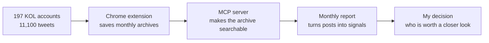

# I work in user growth. These are the tools I built when the manual work stopped scaling.

I'm Melodie Liu. I've spent eight years in user growth across education, FinTech and Web3.

I'm not a software engineer. I use AI to build tools for work I was already doing by hand: researching KOLs, reviewing meetings and turning scattered information into something I can actually make decisions from.

The main project here is a KOL intelligence pipeline. The other two tools came from the same habit: when repetitive work becomes the bottleneck, I stop adding more people and first ask whether the workflow itself can be rebuilt.

---

## The main project: a KOL intelligence pipeline

I used to research KOLs by opening tabs and reading timelines one by one. That worked for ten accounts. It did not work for 197.

So I built this:

The Chrome extension saved **11,100 tweets from 197 accounts** as monthly Markdown files. I then wrapped that archive in an MCP server, so I could ask Claude a normal question instead of searching files manually. The final output is a monthly report that helps me see which narratives are moving and which accounts are worth investigating.

| Part | What it does | Code |
|---|---|---|
| Twitter exporter | Saves a KOL's monthly timeline as Markdown | [`twitter-exporter`](./01-kol-growth-intelligence/twitter-exporter) |
| MCP server | Gives Claude `list_kols` and `search_kol` tools | [`mcp-server`](./01-kol-growth-intelligence/mcp-server) |
| Case study | Shows how the workflow grew from a manual task into a working system | [Read it here](./03-case-studies/kol-growth-intelligence.md) |

This did not directly generate revenue, and I don't claim that it did. It made research that was slow and disposable become searchable, repeatable and useful for partnership decisions.

---

## Two smaller tools, built for the same reason

### Meeting transcript exporter

I had **678 meeting recordings** in iFlyrec. The transcripts existed, but there was no useful bulk export.

I worked with AI to trace the site's real POST request, request body and pagination cursor, then built a Chrome extension that could export one transcript or load the full history in batches.

[See the transcript exporter](./02-workflow-automation/transcript-exporter)

### Course clippings exporter

I had bought 30–40 courses on Dedao and wanted them in my own notes. Copying lessons one by one was never going to finish.

The extension saves whole courses as Markdown and writes them straight to a folder on my Mac. It took 55 rounds of real use and bug-fixing to reach v1.85. The interesting part was not the amount of code; it was learning to catch failures that looked successful but silently saved the wrong title or cut off the text.

[See the course exporter](./02-workflow-automation/course-clippings-exporter) · [Read the engineering case](./02-workflow-automation/course-clippings-exporter/ENGINEERING_CASE_STUDY.md)

---

## What I did, and what AI did

I chose the problems, decided what the tools needed to produce, tested them on real work and kept rejecting outputs that were technically “working” but not useful.

AI wrote most of the implementation and helped debug it. I don't present myself as the engineer who hand-coded every line. What I can do is turn a messy operating problem into a buildable system, direct AI through the iterations, and judge whether the result is good enough to use.

That's the part of AI-native work I care about.

---

## The growth work behind the tools

Before building these tools, I had already spent years doing the work they are meant to support:

- At OKX, I managed roughly 300 affiliate partners and produced more than **25M USDT in cumulative profit**.
- In one KOL case, first trades went from **26 to 144**, and rebates increased **65%**.
- At Zuoyebang, the expansion rate reached **18%**, against a 13–14% industry benchmark.

Those results were not caused by the code in this repository. They are here to explain the context: **growth is the job; AI is how I now make parts of that job faster and more scalable.**

---

## A note on the code

These are working tools from my own setup, not polished consumer products. The KOL MCP server expects the file format produced by the paired exporter, and the raw tweet archive and private reports are not included here.

The repository contains code and documentation only—no tweet archive, meeting transcript, API token or private key.

---

Melodie Liu (刘成成) · User Growth · English / 中文 
[Email me](mailto:melodieliu13@gmail.com)

<strong>中文说明</strong>

### 我做用户增长。这些工具，都是手工活撑不住以后，我用 AI 给自己造的。

主作品是一条 KOL 情报流水线：Chrome 插件存下 197 个账号、11,100 条推文；MCP Server 让 Claude 可以直接查询这批资料；最后产出月度情报，帮助我判断哪些叙事在动、哪些账号值得继续研究。

另外两个插件分别解决 678 条会议转写无法批量导出，以及 30–40 门课程无法完整进入个人知识库的问题。

我不是手写每一行代码的工程师。问题怎么定义、工具要交付什么、什么结果才算真的能用，由我决定；实现和调试主要由 AI 完成。增长是我的工作，AI 是我现在放大这份工作的方式。

