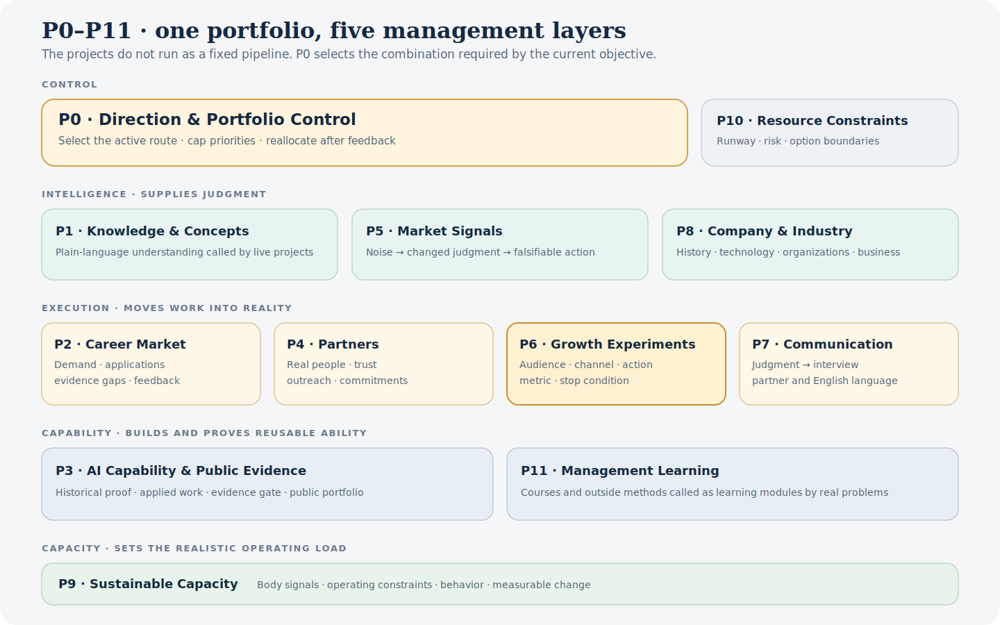
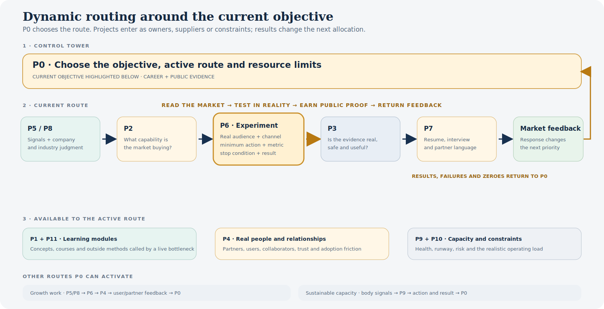

# MelodieOS

## A dynamic operating system for managing complex reality

**MelodieOS is the system I built to turn recurring problems into projects, rules, experiments and measurable change—with AI as a replaceable execution layer.**

| 12 connected project domains | One portable operating context | Evidence in use |
|---|---|---|
| Direction, intelligence, execution, capability and capacity | Different agents continue from the same project state; I retain the goals, facts and final judgment | ~200 public accounts and 11,100 posts turned into searchable evidence, a market judgment and a partner decision brief. |

## 1. Why I built it

Each project was created after a recurring problem could no longer be managed through memory or isolated AI conversations.

- A new AI agent meant explaining the same context again.
- Courses, clips and market information accumulated without changing action.
- Career, growth, relationships, language, health and finances competed for the same attention.
- An agent could finish a task while missing the long-term goal or a real-life constraint.

I gave each recurring problem an accountable project, then let **P0 · Direction & Portfolio Control** choose the operating route for the current goal. The route changes with the goal or evidence.

## 2. The P0–P11 system map

| Layer and project | Recurring problem | System response and current role |
|---|---|---|
| **Control · P0 Direction & Portfolio Control** | Twelve areas were competing for attention. | Selects the current operating route, caps visible daily actions and reallocates resources after feedback. |
| **Control · P10 Resource & Financial Constraints** | Career and learning plans could ignore real runway and risk. | Keeps options, concentration risk and resource boundaries inside planning without exposing private amounts. |
| **Intelligence · P1 Knowledge & Concept Intelligence** | Unfamiliar concepts repeatedly blocked judgment. | Maintains one plain-language understanding that can be called by the projects that need it. |
| **Intelligence · P5 Market Signal Intelligence** | News, KOLs and market noise did not automatically produce action. | A signal must state what judgment changed, what action follows and what would disprove it. |
| **Intelligence · P8 Company & Industry Intelligence** | Company descriptions could not explain industry position or organizational behavior. | Connects history, technology, organizations and business models to improve live judgment. |
| **Execution · P2 Career Market Intelligence** | Job applications, market demand and personal evidence were disconnected. | Turns repeated role requirements and recruiter feedback into priorities, applications and evidence gaps. |
| **Execution · P4 Partner & Relationship Operations** | Relationship frameworks were growing faster than real relationships were moving. | Defines completion as a real conversation, outreach or next commitment—not another framework. |
| **Execution · P6 Growth Experimentation** | Knowing a growth method did not prove I could make it work. | Converts signals and borrowed methods into scoped tests with a real audience, channel, action, metric and stop condition. |
| **Execution · P7 Cross-language Communication** | Complex judgment did not always become clear interview, partner or English communication. | Converts internal thinking into language I can actually use with another person. |
| **Capability · P3 AI Capability & Public Evidence** | Learning AI or building a tool did not make it credible to an employer. | Separates historical evidence, applied work and future experiments; only qualified proof becomes public. |
| **Capability · P11 Management Learning** | Completed courses still had to be reread before they could help. | Treats 45 courses as learning modules called by a live problem rather than as a study schedule. |
| **Capacity · P9 Sustainable Capacity** | Physical condition changed the execution capacity of every other project. | Uses baselines, constraints and feedback to adjust behavior and the portfolio's realistic workload. |

Some projects control, some supply intelligence, some execute and some define capacity. Their value lies in the combination chosen for the current result.

## 3. How the flywheel works

P0 is the control tower, not a permanent pipeline. It chooses a route around the objective. The current career-and-evidence route is:

> **P5/P8 read the market → P2 identifies what the market is buying → P6 tests it on a real audience or channel → P3 decides whether the evidence is ready → P7 makes it usable in a resume or interview → market feedback returns to P0.**

A growth route can run from P5/P8 through P6 and P4 to partners; a health route can run from body signals through P9 back to P0. The system does not force every problem through one sequence.

**P6 is the execution and experimentation engine.** A qualified test needs a hypothesis, real audience or channel, minimum action, measurement rule and stop condition. Its result determines whether the method becomes an applied output, continues or is rejected.

External expertise enters as a **learning module** only when a live project has a bottleneck. It becomes capability after changing a decision or producing an **applied output**: a tool, experiment, judgment, message or public proof. Completion alone is not evidence.

AI retrieves, compares, implements and handles repetition. I own the objective, causality, priority, privacy, acceptance standard and final decision. Agents can change; accountability does not.

## 4. What changed in reality

### Sustainable capacity

P9 converted “lose weight and feel better” into a baseline, daily constraints and weekly feedback. From March 21 to July 20, 2026, body weight decreased by **5 kg** and body-fat rate decreased by **3.6 percentage points**, with the project still progressing. A vague intention became a maintained routine and measured result.

### Market intelligence became usable

The KOL workflow turned **~200 public accounts and 11,100 posts** into searchable evidence, a market judgment and a partner brief. Tools handle scale; the recommendation and stop conditions remain human decisions. [Inspect the workflow](../01-kol-growth-intelligence/) and [sanitized input → output](../03-case-studies/kol-growth-intelligence-output.md).

### Public evidence gained an honest gate

GitHub is a selective public-evidence outlet of MelodieOS, not a gallery in which every item has the same origin:

- **Partner Acquisition** and **Campaign Operations** are historical OKX results, organized by the current system.
- **KOL Partner Intelligence** is an existing work asset and tool, sanitized and accepted by P3 for public inspection.
- **Growth playbooks** marked `Next experiment` are designs. Only a real run can change that label.

### The system also removes work

- P4 had 11 course sets and 1,339 lines of playbook but only one real use in 21 days. The rule changed: stop adding frameworks; move one relationship.
- P8 accumulated structure for 23 days without completing an external-facing analysis. A live case then replaced further framework-building as the priority and corrected the system's own stale verification status.
- P6 had several parallel growth directions. They were reduced to one controlled experiment, with early attempts kept manual until reality justifies automation.

These corrections show the ability to pause, simplify, reject and move resources when evidence does not justify the structure.

## 5. Why this is not another knowledge vault

| A typical knowledge vault | MelodieOS |
|---|---|
| Saves what I read | Records what changed a judgment, action or rule |
| Organizes mainly by topic | Gives recurring real-world problems an accountable project |
| Depends on me remembering to search | Lets an agent retrieve from the current project's rules and evidence |
| Treats more content as progress | Keeps learning as input; measured action and feedback are the test |
| Ends with knowledge | Ends with a decision, experiment, result and updated priority |
| Uses AI to generate content | Uses AI for execution while I retain causality, priority and acceptance |

MelodieOS contains **7,470 private Markdown files inside P0–P11 as of July 20, 2026**: active work, course materials, source archives and system records—not 7,470 original essays. Scale shows history; it does not substitute for outcomes.

## 6. From a personal operating system to a Growth OS

The transferable skill is recognizing a recurring problem, assigning ownership, choosing the right project combination, running a measured action and changing the next allocation from feedback.

Inside a team, the same logic becomes a Growth OS:

> **Business goal → choose the operating route → assign intelligence, execution and capability roles → run measured tests → preserve evidence → reallocate resources from feedback.**

That is how I approach partner growth: find opportunities, form a judgment, test the smallest useful action, define when to stop and improve the next decision.

The content remains private. The operating architecture, decision rules, evidence standards and selected outcomes are public. Raw Markdown, personal records, paid-course content, employer materials, prompts, credentials and source archives are not.

[Return to the AI × Growth portfolio](../README.md)
