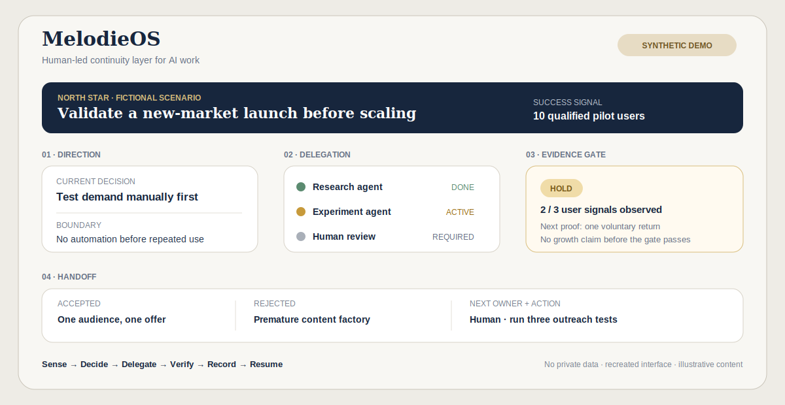

# MelodieOS

## A private command layer for durable, human-led work with AI

**Any capable AI agent can join the work. The work does not reset.**

Most AI workflows end when a conversation ends. MelodieOS keeps the management layer continuous: the goal, current state, delegated responsibility, accepted evidence, decision boundary and next action remain available to the next capable agent.



> **Synthetic public demo.** Every project, number, status and interface element in this image is fictional. It contains no private MelodieOS source, Markdown, screenshot, directory name, personal record or real project detail.

## The management problem

When work spans many conversations and different AI agents, five failures recur:

- the goal gets replaced by the latest request;
- context has to be explained again;
- delegation has no explicit boundary;
- generated output is mistaken for accepted evidence;
- the next person or agent cannot tell what changed or what to do next.

MelodieOS turns that discontinuity into a managed loop:

```text
Goal → Current state → Delegation → Verification → Decision → Handoff → Resume
```

## What the product manages

| Control | Management question | Product behavior |
|---|---|---|
| **Direction** | What outcome matters now? | Keeps one explicit objective and the constraint that governs current work. |
| **State** | What is true at this moment? | Separates completed, active, blocked and unverified work. |
| **Delegation** | Who owns which part? | Gives each human or AI agent a bounded job and an acceptance standard. |
| **Evidence** | What may be treated as fact? | Keeps drafts, claims and verified evidence in different states. |
| **Handoff** | How can the next agent continue? | Records what changed, what was rejected and the next executable action. |
| **Privacy** | What must never cross the boundary? | Keeps private source material outside the public proof layer. |

## What this demonstrates about how I manage

- I translate an ambiguous ambition into an outcome, owner, boundary and acceptance test.
- I use AI for parallel execution without outsourcing priority or judgment.
- I make rejection visible: an AI output does not become system truth merely because it is polished.
- I preserve decision continuity across tools and agents instead of depending on one model's memory.
- I separate private operating context from public, reviewable evidence.

## Honest scope

**What exists:** a private system used to manage ongoing work across multiple AI agents, with persistent context, explicit handoffs and human review.

**What this public page is:** a product explanation and a synthetic interface that demonstrate the management model without exposing the private implementation.

**What this is not:** an autonomous multi-agent platform, a public source release or proof that AI made the underlying business decisions.

## Zero-leakage boundary

| Public | Never public |
|---|---|
| Product promise and management model | Private Markdown or source text |
| Synthetic interface and fictional scenario | Real screenshots or directory structure |
| Abstract workflow and role boundaries | Personal, employer or relationship records |
| Sanitized explanation of human–AI responsibility | Prompts, memories, logs, credentials or private decisions |

The private repository is not linked, mirrored or partially published. The public artifact is recreated from zero with fictional data.

[Return to the AI × Growth portfolio](../README.md)
